# Laporan Hasil Eksperimen

**Judul Penelitian:**  
Eksperimen Klasifikasi Depresi pada Remaja: Perbandingan Metode Feature Selection untuk Identifikasi Fitur Gaya Hidup Paling Berpengaruh

| Identitas | Keterangan |
|-----------|------------|
| Nama | Naf’an Nur’Alim |
| NIM | A11.2024.15651 |
| Mata Kuliah | Pembelajaran Mesin |
| Tipe Dokumen | Laporan Hasil Eksperimen |
| Dataset | Teen Mental Health Dataset (1.500 observasi) |

---

## Daftar Isi

1. [Pendahuluan](#1-pendahuluan)
2. [Tujuan dan Rumusan Masalah](#2-tujuan-dan-rumusan-masalah)
3. [Metodologi Singkat](#3-metodologi-singkat)
4. [Hasil EDA](#4-hasil-eda)
5. [Hasil Preprocessing](#5-hasil-preprocessing)
6. [Hasil Eksperimen Feature Selection](#6-hasil-eksperimen-feature-selection)
7. [Hasil Analisis SHAP (XAI)](#7-hasil-analisis-shap-xai)
8. [Jawaban Rumusan Masalah (RQ)](#8-jawaban-rumusan-masalah-rq)
9. [Validasi Hipotesis](#9-validasi-hipotesis)
10. [Kesimpulan dan Saran](#10-kesimpulan-dan-saran)
11. [Daftar Bukti dan Lampiran](#11-daftar-bukti-dan-lampiran)

---

## 1. Pendahuluan

Penelitian ini dilakukan untuk melihat fitur gaya hidup mana yang paling berpengaruh terhadap indikasi depresi pada remaja. Fokus utamanya **bukan** membandingkan banyak algoritma klasifikasi, melainkan membandingkan metode **feature selection**.

Alasannya sesuai arahan dosen: gejala depresi biasanya tidak ditentukan oleh satu atribut saja. Kalau hanya melihat korelasi satu fitur dengan label, itu masih bersifat eksplorasi (EDA) dan belum cukup untuk menentuikan fitur terpenting. Karena itu, dalam eksperimen ini dilakukan perbandingan:

- **FS0** — tanpa seleksi (semua fitur / baseline)
- **FS1** — PCA
- **FS2** — Chi-Square
- **FS3** — Mutual Information

Semua skenario dievaluasi menggunakan klasifikator yang sama, yaitu **Random Forest** (`class_weight='balanced'`), supaya perbedaan hasil benar-benar berasal dari metode feature selection-nya.

Sebagai pelengkap, dilakukan juga analisis **SHAP** untuk memastikan fitur yang terpilih memang berkontribusi terhadap prediksi model.

---

## 2. Tujuan dan Rumusan Masalah

### 2.1 Tujuan

1. Membandingkan performa metode feature selection (PCA, Chi-Square, Mutual Information) terhadap prediksi `depression_label`.
2. Menemukan fitur gaya hidup yang paling berpengaruh.
3. Menganalisis perbedaan karakteristik tiap metode feature selection.
4. Memverifikasi hasil seleksi fitur menggunakan SHAP (XAI).

### 2.2 Rumusan Masalah (RQ)

| Kode | Pertanyaan |
|------|------------|
| **RQ1** | Metode feature selection mana yang paling baik berdasarkan F1-Score dan ROC-AUC? |
| **RQ2** | Fitur gaya hidup apa yang paling konsisten terpilih sebagai fitur berpengaruh? |
| **RQ3** | Bagaimana perbedaan karakteristik PCA, Chi-Square, dan Mutual Information pada dataset ini? |
| **RQ4** | Sejauh mana hasil SHAP selaras dengan hasil feature selection? |

---

## 3. Metodologi Singkat

Eksperimen dijalankan lewat empat notebook:

```text
01_eda.ipynb
   ↓
02_preprocessing.ipynb
   ↓
03_experiment_feature_selection.ipynb
   ↓
04_xai_shap_analysis.ipynb
```

### 3.1 Dataset

- Sumber: Teen Mental Health Dataset (Kaggle)
- Jumlah data akhir: **1.500 baris**
- Target: `depression_label` (0 = tidak depresi, 1 = terindikasi depresi)
- Rasio kelas: **90% : 10%** (imbalance)

### 3.2 Konfigurasi Model (Tetap)

| Komponen | Nilai |
|----------|-------|
| Algoritma | Random Forest |
| `n_estimators` | 100 |
| `class_weight` | balanced |
| `random_state` | 42 |
| Split data | Stratified 80:20 (train 1.200 / test 300) |
| Validasi | Stratified 5-Fold CV |

### 3.3 Metrik Evaluasi

Karena data tidak seimbang, metrik utama yang dipakai adalah:

- **F1-Score**
- **Recall**
- **ROC-AUC**

Accuracy tetap dicantumkan, tetapi tidak dijadikan patokan utama.

---

## 4. Hasil EDA

### 4.1 Distribusi Kelas

Dari EDA, diketahui bahwa dataset memang tidak seimbang:

| Label | Jumlah | Persentase |
|-------|--------|------------|
| 0 (tidak depresi) | 1.350 | 90,0% |
| 1 (depresi) | 150 | 10,0% |

**Bukti visual:**


**Interpretasi singkat:**  
Model mudah “terlihat bagus” kalau hanya dilihat dari accuracy, karena kelas mayoritas sangat dominan. Makanya F1 dan Recall lebih penting.

### 4.2 Korelasi Fitur dengan Target (Eksploratif)

Hasil korelasi tunggal (EDA saja, belum kesimpulan final):

| Fitur | Korelasi dengan `depression_label` |
|-------|------------------------------------|
| `sleep_hours` | −0,346 |
| `daily_social_media_hours` | +0,315 |
| `stress_level` | +0,310 |
| `anxiety_level` | +0,309 |

**Bukti visual:**

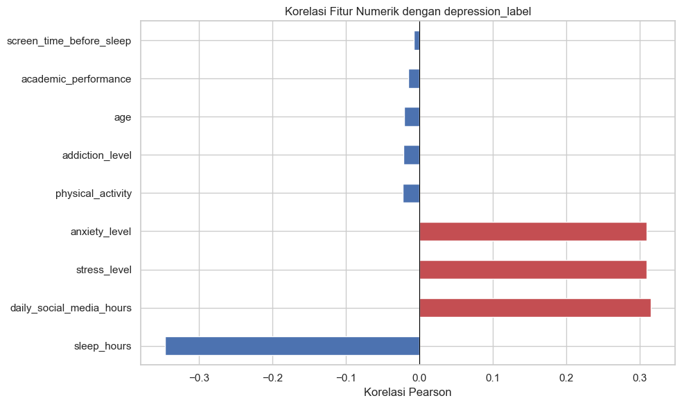


**Catatan penting:**  
Korelasi di atas hanya petunjuk awal. Indikasi depresi dipengaruhi kombinasi multi-fitur, jadi kesimpulan fitur terpenting diambil dari eksperimen feature selection + SHAP, bukan dari korelasi tunggal saja.

### 4.3 Distribusi Fitur

**Bukti visual distribusi numerik dan kategori:**

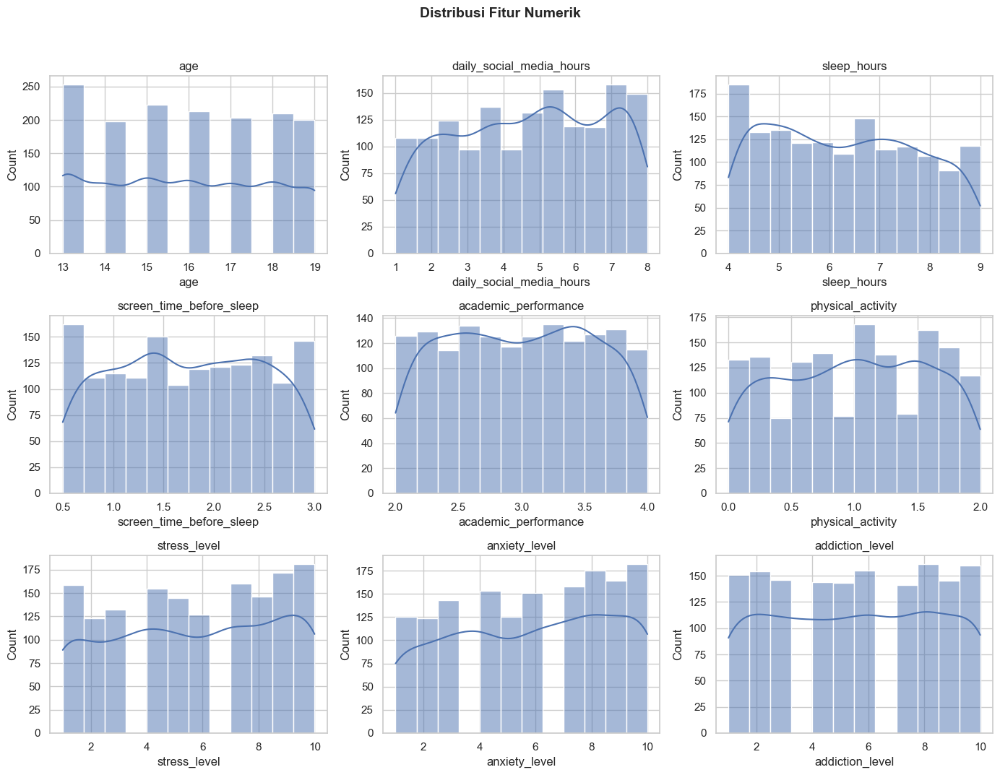

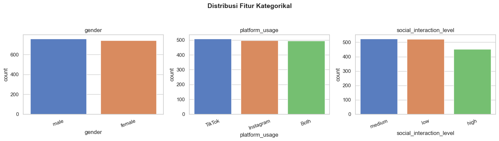

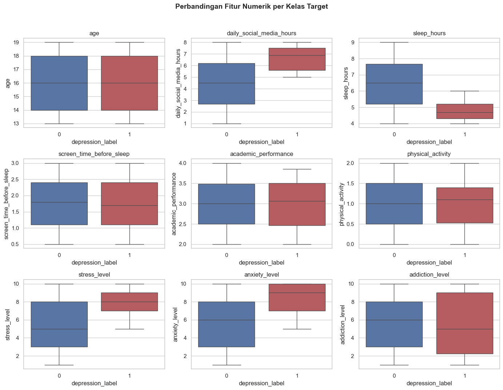

---

## 5. Hasil Preprocessing

Pada tahap preprocessing dilakukan:

1. Imputasi missing values (jika ada)
2. Penanganan outlier dengan clipping IQR
3. Feature engineering: `screen_time_ratio`
4. Encoding fitur kategorikal
5. Stratified train/test split
6. Scaling:
   - **StandardScaler** → untuk PCA & Mutual Information
   - **MinMaxScaler** → untuk Chi-Square

### 5.1 Ringkasan Preprocessing

| Tahap | Nilai |
|-------|------:|
| Raw samples | 1.500 |
| After cleaning | 1.500 |
| Features after encoding | 14 |
| Train samples | 1.200 |
| Test samples | 300 |
| Positive class (train) | 120 |
| Positive class (test) | 30 |

**Bukti visual scaling:**

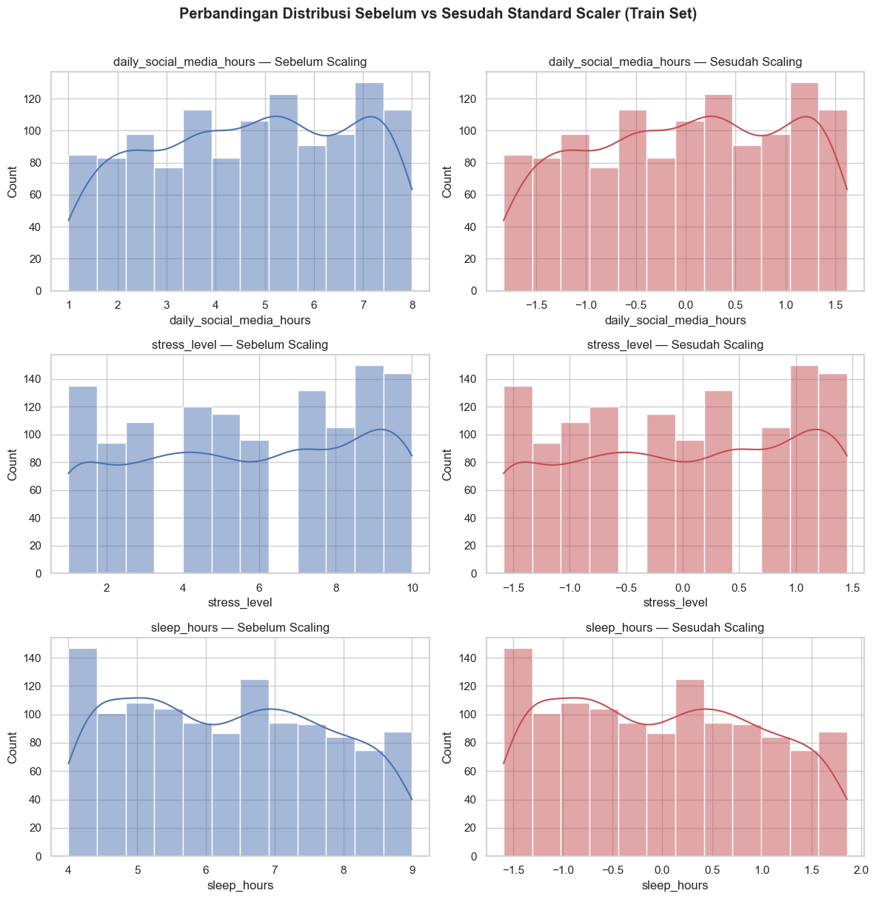

### 5.2 Daftar Fitur Setelah Preprocessing

Setelah encoding dan feature engineering, fitur yang dipakai adalah:

1. `age`
2. `gender`
3. `daily_social_media_hours`
4. `sleep_hours`
5. `screen_time_before_sleep`
6. `academic_performance`
7. `physical_activity`
8. `social_interaction_level`
9. `stress_level`
10. `anxiety_level`
11. `addiction_level`
12. `screen_time_ratio`
13. `platform_Instagram`
14. `platform_TikTok`

---

## 6. Hasil Eksperimen Feature Selection

### 6.1 Tujuan Eksperimen

Membandingkan empat skenario feature selection (FS0–FS3) dengan klasifikator Random Forest yang sama, lalu mencari metode terbaik berdasarkan F1-Score dan ROC-AUC.

### 6.2 Tuning Parameter k (FS2 & FS3)

Untuk Chi-Square dan Mutual Information, diuji nilai **k = 5, 8, 10** menggunakan 5-Fold CV.

**Hasil terbaik dari tuning:**

| Metode | k Optimal | CV F1 |
|--------|----------:|------:|
| Chi-Square (FS2) | 8 | 0,9698 |
| Mutual Information (FS3) | 5 | 0,9574 |

> Catatan: pada hasil CV, k=5 untuk MI memang bagus; saat evaluasi test set (final), FS3 dengan k=5 juga tetap unggul menurut ROC-AUC.

**Bukti visual:**

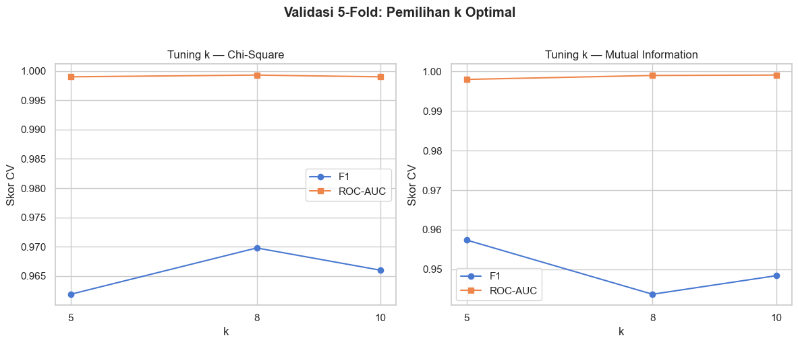

### 6.3 PCA (FS1)

Jumlah komponen PCA ditentukan agar cumulative explained variance ≥ 95%. Hasilnya:

- Jumlah komponen: **12**
- Cumulative variance PC12: **0,9638 (96,38%)**

**Bukti visual:**

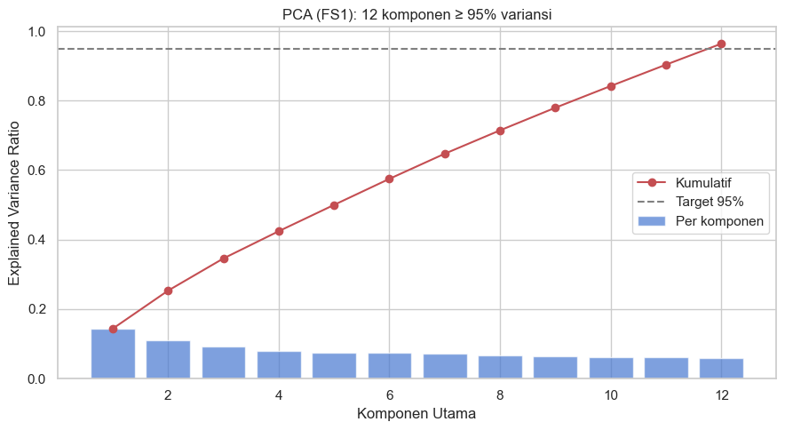

**Interpretasi:**  
PCA berhasil mereduksi/mentransformasi dimensi, tapi hasilnya jadi komponen (`PC1`, `PC2`, …), bukan nama fitur asli seperti `sleep_hours`. Jadi, PCA kurang mudah diinterpretasi secara klinis.

### 6.4 Hasil Perbandingan FS0–FS3 (Hold-out Test Set)

Hasil evaluasi akhir pada data uji (300 sampel):

| Skenario | Metode | Accuracy | Precision | Recall | **F1** | **ROC-AUC** |
|----------|--------|---------:|----------:|-------:|-------:|------------:|
| FS0 | Tanpa seleksi (14 fitur) | 0,9833 | 1,0000 | 0,8333 | 0,9091 | 0,9970 |
| FS1 | PCA (≥95% variansi, 12 PC) | 0,9467 | 0,8889 | 0,5333 | 0,6667 | 0,9644 |
| FS2 | Chi-Square (k=8) | 0,9967 | 1,0000 | 0,9667 | **0,9831** | 0,9980 |
| **FS3** | **Mutual Information (k=5)** | **0,9967** | **1,0000** | **0,9667** | **0,9831** | **0,9987** |

**Skenario terbaik:** **FS3 (Mutual Information, k=5)**  
Alasan: F1-Score sama tinggi dengan FS2, tetapi ROC-AUC FS3 sedikit lebih tinggi (0,9987).

**Bukti visual:**

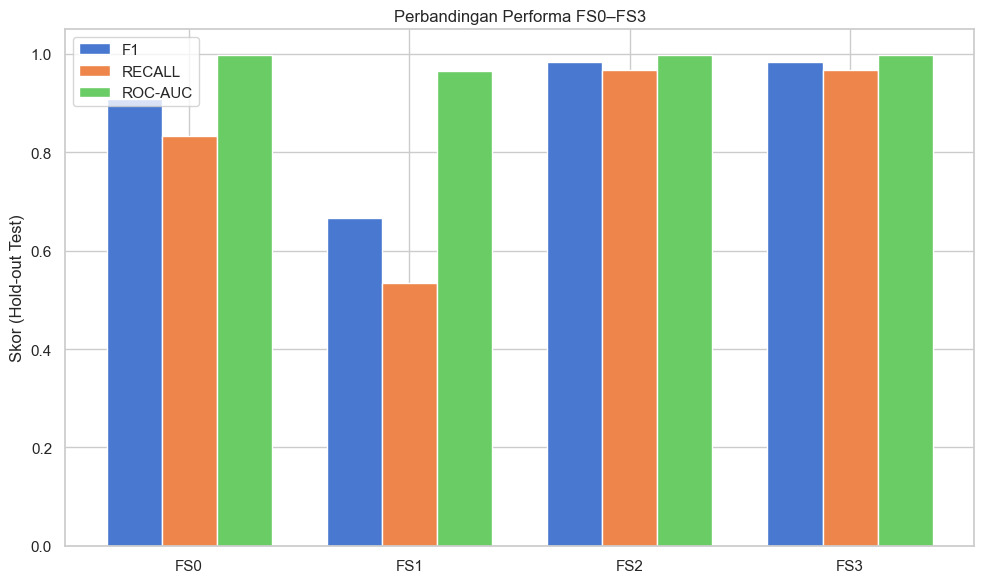


### 6.5 Hasil Cross Validation vs Test Set

| Skenario | CV F1 | Test F1 | Selisih (Test − CV) |
|----------|------:|--------:|--------------------:|
| FS0 | 0,9476 | 0,9091 | −0,0385 |
| FS1 | 0,7387 | 0,6667 | −0,0720 |
| FS2 | 0,9698 | 0,9831 | +0,0133 |
| FS3 | 0,9528 | 0,9831 | +0,0303 |

**Interpretasi:**  
FS2 dan FS3 relatif stabil. Penurunan performa yang lebih terlihat justru pada PCA (FS1), terutama di Recall.

### 6.6 Ranking Fitur (RQ2)

#### A. Hasil Chi-Square (FS2) — top-8

| Rank | Fitur | Skor Chi-Square |
|-----:|-------|----------------:|
| 1 | `sleep_hours` | 26,2445 |
| 2 | `stress_level` | 24,3676 |
| 3 | `anxiety_level` | 21,0332 |
| 4 | `daily_social_media_hours` | 20,1386 |
| 5 | `screen_time_ratio` | 3,3159 |
| 6 | `platform_Instagram` | 2,9747 |
| 7 | `gender` | 1,5938 |
| 8 | `platform_TikTok` | 1,0835 |

**Bukti visual:**

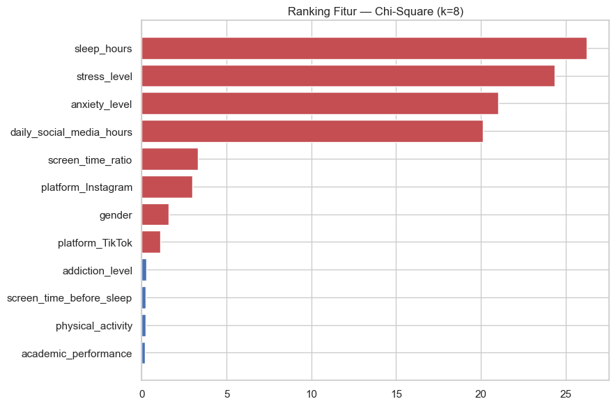

#### B. Hasil Mutual Information (FS3) — top-5

| Rank | Fitur | Skor MI |
|-----:|-------|--------:|
| 1 | `sleep_hours` | 0,1014 |
| 2 | `stress_level` | 0,0828 |
| 3 | `daily_social_media_hours` | 0,0797 |
| 4 | `anxiety_level` | 0,0733 |
| 5 | `physical_activity` | 0,0412 |

**Bukti visual:**

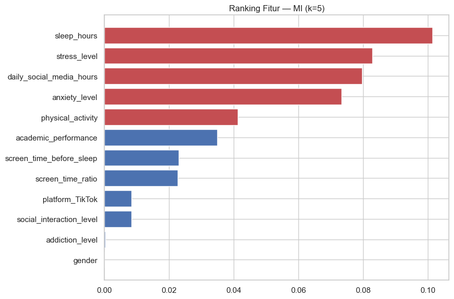

#### C. Fitur yang Konsisten (FS2 ∩ FS3)

Fitur yang muncul di kedua metode filter:

1. `sleep_hours`
2. `stress_level`
3. `anxiety_level`
4. `daily_social_media_hours`

**Bukti visual:**


**Interpretasi:**  
Empat fitur di atas paling kuat sebagai kandidat fitur gaya hidup paling berpengaruh pada eksperimen ini.

---

## 7. Hasil Analisis SHAP (XAI)

### 7.1 Tujuan Analisis SHAP

SHAP dipakai untuk menjawab **RQ4**:  
apakah kontribusi fitur menurut model benar-benar selaras dengan hasil feature selection.

Analisis dilakukan pada:

1. Model terbaik **FS3** (Mutual Information + Random Forest)
2. Baseline **FS0** (semua fitur) agar ranking bisa dibandingkan dengan Chi-Square dan MI

### 7.2 Ranking SHAP pada Model Terbaik (FS3)

| Rank | Fitur | Mean \|SHAP\| |
|-----:|-------|--------------:|
| 1 | `stress_level` | 0,155098 |
| 2 | `sleep_hours` | 0,150356 |
| 3 | `daily_social_media_hours` | 0,133080 |
| 4 | `anxiety_level` | 0,131704 |
| 5 | `academic_performance` | 0,017145 |

**Bukti visual:**

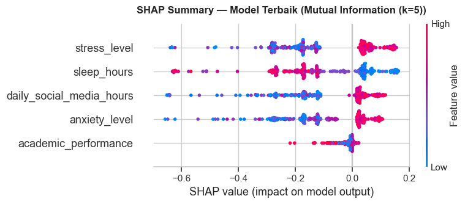

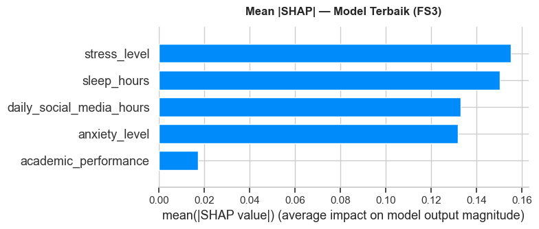

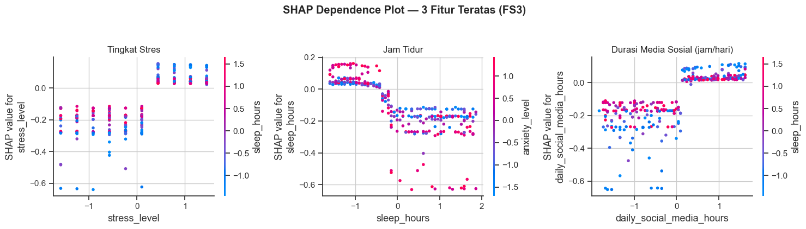

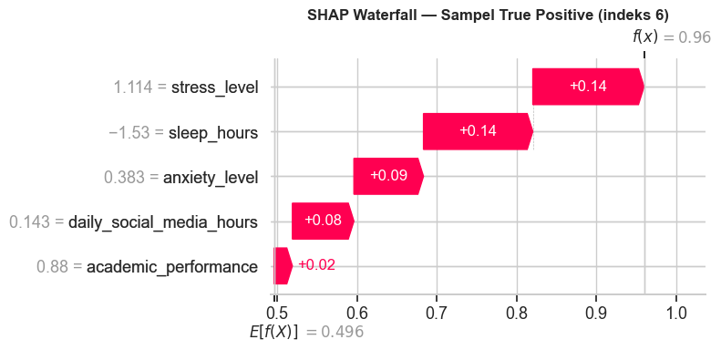

**Interpretasi singkat:**  
Pada model terbaik, fitur yang paling besar dorongannya terhadap prediksi depresi adalah tingkat stres, jam tidur, durasi media sosial, dan tingkat kecemasan.

### 7.3 Ranking SHAP pada Baseline (FS0)

Top-5 fitur menurut SHAP (semua fitur):

| Rank | Fitur | Mean \|SHAP\| |
|-----:|-------|--------------:|
| 1 | `stress_level` | 0,136415 |
| 2 | `sleep_hours` | 0,122522 |
| 3 | `anxiety_level` | 0,116523 |
| 4 | `daily_social_media_hours` | 0,106722 |
| 5 | `physical_activity` | 0,022157 |

**Bukti visual:**

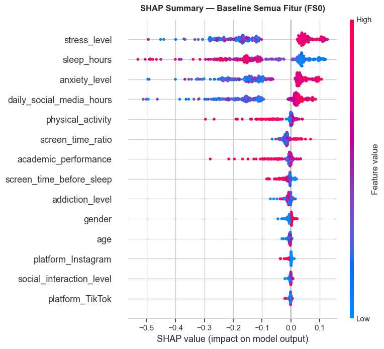

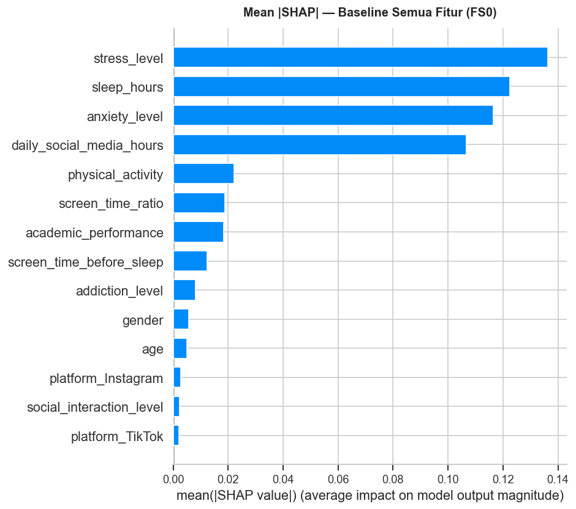

### 7.4 Keselarasan SHAP vs Feature Selection

| Indikator | Hasil |
|-----------|-------|
| Spearman rank SHAP vs Chi-Square | **0,6527** (p = 0,0114) |
| Spearman rank SHAP vs Mutual Information | **0,8663** (p = 0,0001) |
| Overlap top-5 SHAP & Chi-Square | 4/5 fitur sama |
| Overlap top-5 SHAP & MI | 5/5 fitur sama |
| Overlap top-5 ketiga metode | `sleep_hours`, `stress_level`, `anxiety_level`, `daily_social_media_hours` |

**Bukti visual:**

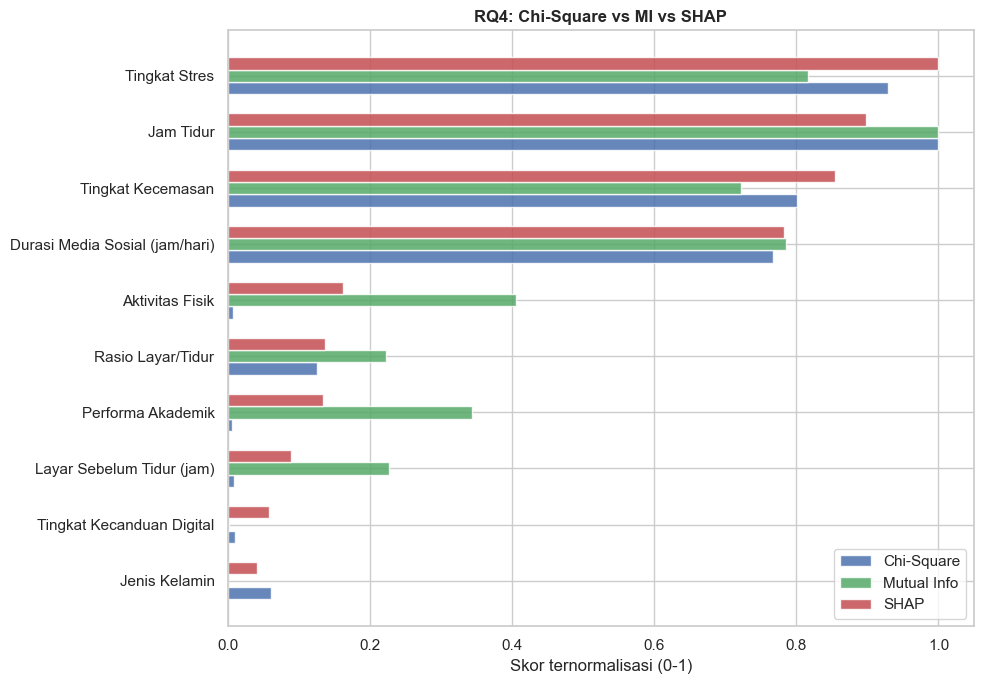

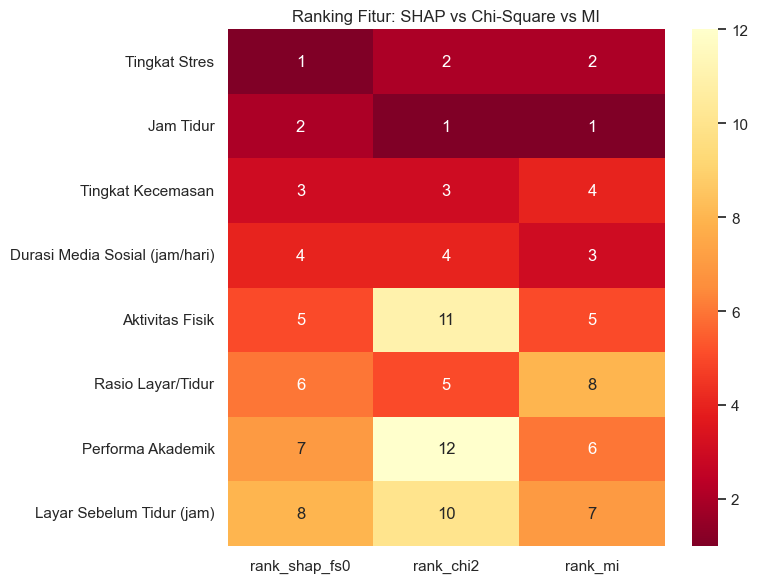

**Interpretasi:**  
Hasil SHAP cukup selaras dengan feature selection, terutama dengan Mutual Information (korelasi Spearman tinggi). Artinya, fitur yang dianggap penting oleh metode seleksi memang juga berkontribusi besar saat model melakukan prediksi.

---

## 8. Jawaban Rumusan Masalah (RQ)

### RQ1 — Metode feature selection terbaik?

**Jawaban:**  
Metode terbaik secara keseluruhan adalah **Mutual Information (FS3)**, disusul **Chi-Square (FS2)**.

Alasan:

- F1 FS3 = F1 FS2 = **0,9831**
- ROC-AUC FS3 sedikit lebih tinggi (**0,9987** vs 0,9980)
- FS3 hanya memakai **5 fitur**, lebih ringkas daripada FS2 (8 fitur) dan baseline (14 fitur)
- PCA (FS1) justru turun performanya, terutama Recall

### RQ2 — Fitur gaya hidup paling berpengaruh?

**Jawaban:**  
Fitur yang paling konsisten antar metode adalah:

1. **`sleep_hours`** (jam tidur)
2. **`stress_level`** (tingkat stres)
3. **`anxiety_level`** (tingkat kecemasan)
4. **`daily_social_media_hours`** (durasi media sosial harian)

Empat fitur ini muncul di overlap FS2 ∩ FS3, dan juga masuk top kontribusi SHAP.

### RQ3 — Karakteristik tiap metode?

| Metode | Karakteristik yang terlihat dari eksperimen |
|--------|---------------------------------------------|
| **PCA** | Mereduksi dimensi ke 12 komponen, tapi nama fitur hilang sehingga sulit ditafsirkan. Performa juga lebih rendah. |
| **Chi-Square** | Memilih fitur berdasarkan independensi dengan label. Hasilnya bagus dan mudah ditafsirkan. |
| **Mutual Information** | Menangkap hubungan yang lebih kompleks (termasuk non-linear). Hasil akhirnya paling baik dan tetap mempertahankan nama fitur. |

### RQ4 — Apakah SHAP selaras dengan feature selection?

**Jawaban:** Ya, cukup selaras.

Bukti utama:

- Spearman SHAP–MI = **0,8663**
- Overlap top-5 ketiga metode tetap menunjukkan fitur yang sama: tidur, stres, kecemasan, dan media sosial

---

## 9. Validasi Hipotesis

| Kode | Hipotesis | Status | Bukti Singkat |
|------|-----------|--------|---------------|
| **H1** | Mutual Information lebih baik dari Chi-Square pada F1 | **Sebagian (F1 seri)** | F1 FS3 = F1 FS2 = 0,9831; FS3 unggul di ROC-AUC |
| **H2** | PCA kehilangan interpretabilitas nama fitur | **Diterima** | Output PCA berupa PC1–PC12, bukan nama fitur asli |
| **H3** | Feature selection meningkatkan performa dibanding baseline | **Diterima** | Baseline F1 = 0,9091; terbaik = 0,9831 |
| **H4** | Fitur tidur/stres/kecemasan/media sosial konsisten terpilih | **Diterima** | Empat fitur tersebut muncul di FS2, FS3, dan SHAP |

---

## 10. Kesimpulan dan Saran

### 10.1 Kesimpulan

1. Pada dataset ini, metode feature selection **Mutual Information (FS3)** memberikan hasil terbaik secara keseluruhan.
2. Feature selection membantu meningkatkan performa dibanding memakai semua fitur.
3. Fitur gaya hidup yang paling berpengaruh secara konsisten adalah:
   - jam tidur (`sleep_hours`)
   - tingkat stres (`stress_level`)
   - tingkat kecemasan (`anxiety_level`)
   - durasi media sosial (`daily_social_media_hours`)
4. PCA kurang cocok jika tujuan utamanya interpretasi klinis, karena nama fitur asli hilang.
5. Analisis SHAP memperkuat temuan feature selection: kontribusi fitur terhadap prediksi memang mengarah ke atribut yang sama.

Secara singkat: **depresi pada data ini terlihat dipengaruhi oleh kombinasi kualitas tidur, stres, kecemasan, dan kebiasaan media sosial**, bukan oleh satu atribut saja.

### 10.2 Saran

1. Untuk penelitian lanjutan, bisa ditambahkan validasi eksternal (dataset baru) agar hasil lebih general.
2. Bisa dibandingkan juga metode feature selection lain (misalnya RFE) tanpa mengubah fokus riset.
3. Untuk aplikasi praktis, empat fitur konsisten di atas bisa dijadikan fokus monitoring gaya hidup remaja.

---

## 11. Daftar Bukti dan Lampiran

### 11.1 Notebook Sumber

| Notebook | Isi |
|----------|-----|
| `notebooks/01_eda.ipynb` | Eksplorasi data |
| `notebooks/02_preprocessing.ipynb` | Pembersihan & scaling |
| `notebooks/03_experiment_feature_selection.ipynb` | Perbandingan FS0–FS3 |
| `notebooks/04_xai_shap_analysis.ipynb` | Analisis SHAP |

### 11.2 Tabel Hasil (Folder `results/tables/`)

| File | Isi |
|------|-----|
| `05_class_distribution.csv` | Distribusi kelas |
| `08_preprocessing_summary.csv` | Ringkasan preprocessing |
| `10_k_tuning_chi2_mi.csv` | Tuning k FS2/FS3 |
| `11_cv_results_fs_comparison.csv` | Hasil 5-Fold CV |
| `12_test_results_fs_comparison.csv` | Hasil hold-out test |
| `13_chi2_feature_ranking.csv` | Ranking Chi-Square |
| `13_mi_feature_ranking.csv` | Ranking Mutual Information |
| `15_feature_overlap_fs2_fs3.csv` | Overlap fitur FS2 & FS3 |
| `16_overfitting_check.csv` | CV vs Test |
| `17_hypothesis_summary.csv` | Status hipotesis |
| `19_shap_importance_fs3.csv` | Ranking SHAP model terbaik |
| `20_shap_importance_fs0.csv` | Ranking SHAP baseline |
| `22_rq4_shap_summary.csv` | Ringkasan keselarasan RQ4 |

### 11.3 Gambar Bukti (Folder `results/figures/`)

| File | Digunakan di bagian |
|------|---------------------|
| `01_class_distribution.png` | EDA — distribusi kelas |
| `04_correlation_heatmap.png` | EDA — korelasi |
| `05_target_correlation.png` | EDA — korelasi target |
| `09_scaling_comparison.png` | Preprocessing |
| `10_k_tuning.png` | Tuning k |
| `11_fs_comparison_metrics.png` | Perbandingan FS |
| `12_confusion_matrices.png` | Evaluasi klasifikasi |
| `13_roc_curves.png` | Evaluasi klasifikasi |
| `15_pca_explained_variance.png` | PCA |
| `16_chi2_feature_ranking.png` | Ranking Chi-Square |
| `17_mi_feature_ranking.png` | Ranking MI |
| `18_feature_overlap.png` | Overlap fitur |
| `19_shap_summary_fs3.png` | SHAP FS3 |
| `20_shap_bar_fs3.png` | SHAP FS3 |
| `21_shap_dependence_fs3.png` | SHAP dependence |
| `22_shap_waterfall_sample.png` | SHAP waterfall |
| `23_shap_summary_fs0.png` | SHAP baseline |
| `24_shap_vs_feature_selection.png` | Perbandingan SHAP vs FS |
| `25_rank_heatmap_comparison.png` | Heatmap ranking |

### 11.4 Artefak Model

| File | Keterangan |
|------|------------|
| `artifacts/best_fs_model.joblib` | Model terbaik (FS3) |
| `artifacts/experiment_fs_results.json` | Ringkasan hasil eksperimen FS |
| `artifacts/shap_analysis_results.json` | Ringkasan hasil SHAP |
| `artifacts/preprocessing_metadata.json` | Metadata preprocessing |

---

## Ringkasan Satu Paragraf

Dari seluruh eksperimen, metode **Mutual Information (FS3)** menjadi pilihan terbaik untuk klasifikasi depresi pada dataset ini, dengan F1-Score 0,9831 dan ROC-AUC 0,9987. Fitur yang paling konsisten berpengaruh adalah **jam tidur, tingkat stres, tingkat kecemasan, dan durasi media sosial**. Hasil tersebut diperkuat oleh analisis SHAP, sehingga temuan tidak hanya berdasarkan skor seleksi fitur, tetapi juga berdasarkan kontribusi nyata fitur terhadap prediksi model.

---

*Laporan ini disusun berdasarkan output notebook `01`–`04`, tabel di `results/tables/`, dan visualisasi di `results/figures/`.*
