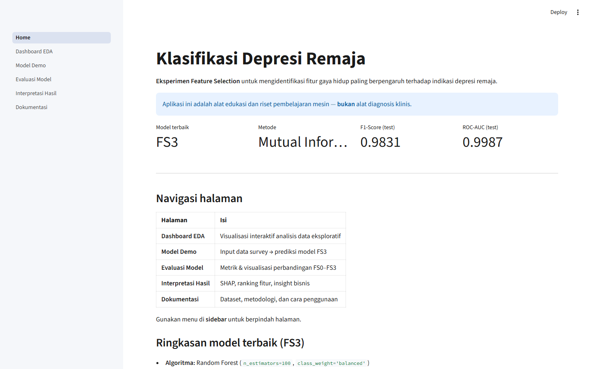
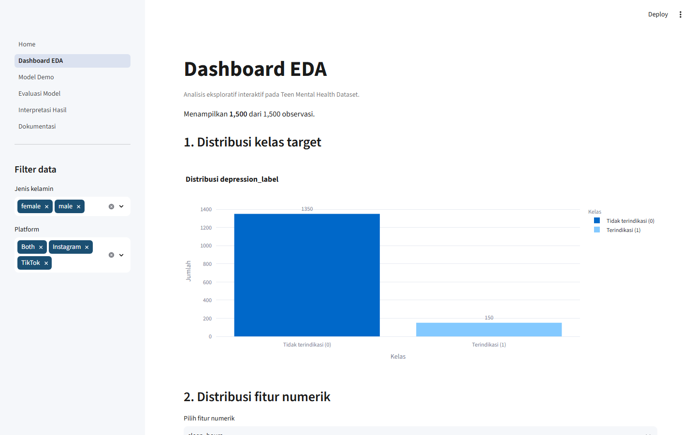
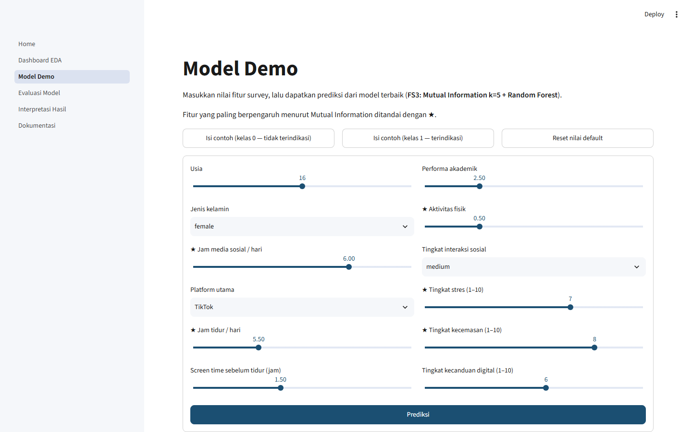
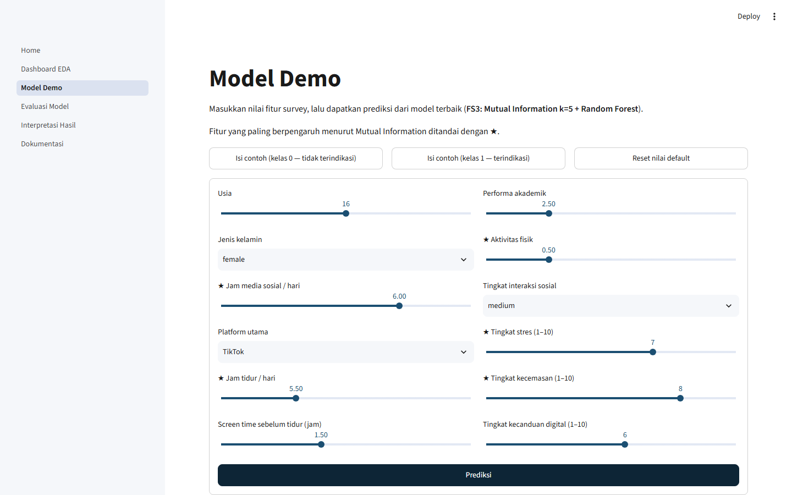
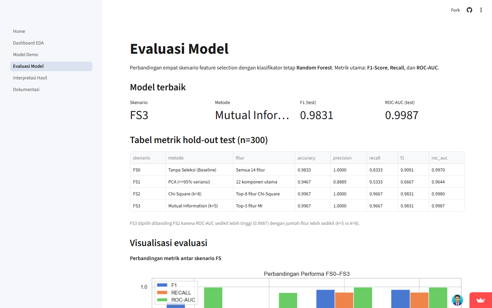
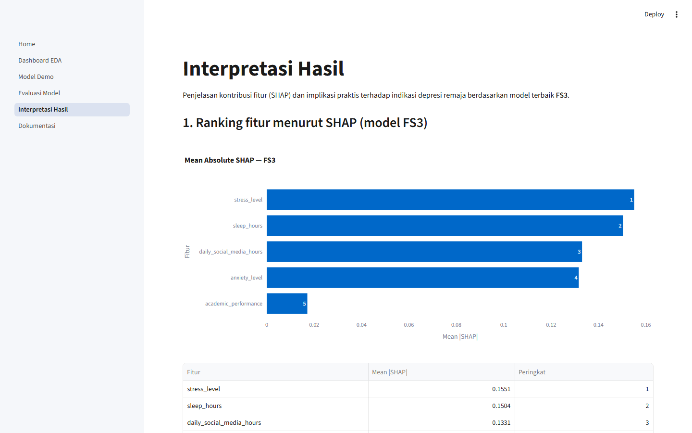
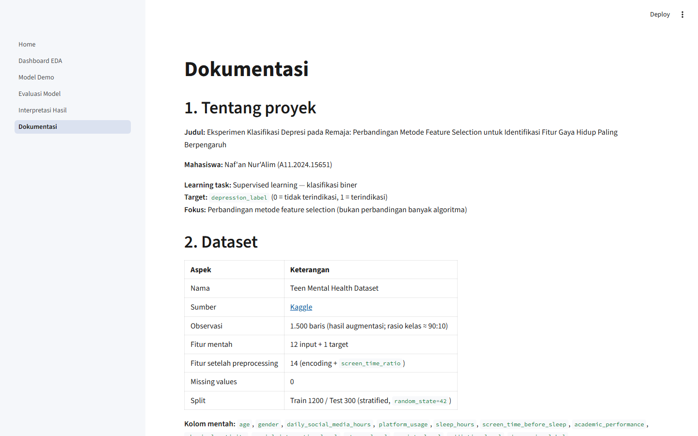

# Deployment and Streamlit Application

**Judul Proyek:** Eksperimen Klasifikasi Depresi pada Remaja: Perbandingan Metode Feature Selection  

**Mahasiswa:** Naf’an Nur’Alim (A11.2024.15651)

---

## 1. Aplikasi yang di-deploy

| Aspek | Keterangan |
| --- | --- |
| **Platform** | Streamlit Community Cloud |
| **URL publik** | https://feature-selection-dataset-nafan.streamlit.app/ |
| **Sumber kode** | [GitHub — Analysis-of-the-Impact-of-Preprocessing…](https://github.com/Nafunnn/Analysis-of-the-Impact-of-Preprocessing-and-Class-Imbalance-on-K-NN-and-Random-Forest-Models) |
| **Entry point (Main file)** | `eksperimen-klasifikasi-depresi/app/Home.py` |
| **Dependencies Cloud** | `requirements.txt` di **root repository** |
| **Model runtime** | `eksperimen-klasifikasi-depresi/artifacts/best_fs_model.joblib` (+ scaler) |

Aplikasi ini menampilkan hasil eksperimen feature selection (FS0–FS3) secara interaktif: EDA, demo prediksi model **FS3 (Mutual Information k=5 + Random Forest)**, evaluasi metrik, interpretasi SHAP, dan dokumentasi metodologi.

> **Disclaimer:** aplikasi bersifat **edukasi & riset pembelajaran mesin**, **bukan** alat diagnosis klinis.

### 1.1 Halaman aplikasi

| Halaman | File | Fungsi |
| --- | --- | --- |
| **Home** | `app/Home.py` | Ringkasan proyek + metrik model terbaik |
| **Dashboard EDA** | `app/pages/1_Dashboard_EDA.py` | Visualisasi interaktif (Plotly) + filter gender/platform |
| **Model Demo** | `app/pages/2_Model_Demo.py` | Form survey → prediksi FS3 (label + probabilitas) |
| **Evaluasi Model** | `app/pages/3_Evaluasi_Model.py` | Tabel metrik FS0–FS3 + gambar ROC/CM |
| **Interpretasi Hasil** | `app/pages/4_Interpretasi_Hasil.py` | Ranking SHAP & insight fitur |
| **Dokumentasi** | `app/pages/5_Dokumentasi.py` | Dataset, metodologi, cara pakai |

### 1.2 Cara deploy (Streamlit Community Cloud)

1. Push repository ke GitHub (berisi `app/`, `artifacts/`, `data/`, `results/`, dan `requirements.txt` root).
2. Buka [share.streamlit.io](https://share.streamlit.io/) → **New app**.
3. Pilih repository, branch `main`.
4. Set **Main file path:** `eksperimen-klasifikasi-depresi/app/Home.py`.
5. Python environment memakai `requirements.txt` di root repo.
6. Deploy → URL: https://feature-selection-dataset-nafan.streamlit.app/

### 1.3 Menjalankan lokal

```bash
cd "eksperimen-klasifikasi-depresi"
pip install -r requirements.txt
streamlit run app/Home.py
```

Atau dari root repo (setelah `pip install -r requirements.txt`):

```bash
streamlit run eksperimen-klasifikasi-depresi/app/Home.py
```

---

## 2. Struktur kode aplikasi

```text
Tugas Akhir/
├── requirements.txt                          # deps Streamlit Community Cloud
├── .streamlit/config.toml                    # tema UI
└── eksperimen-klasifikasi-depresi/
    ├── requirements.txt                      # deps eksperimen + Streamlit lokal
    ├── artifacts/
    │   ├── best_fs_model.joblib              # pipeline FS3 (SelectKBest+RF)
    │   ├── standard_scaler.joblib            # scaler untuk inferensi
    │   ├── preprocessing_metadata.json
    │   ├── experiment_fs_results.json
    │   └── shap_analysis_results.json
    ├── data/Teen_Mental_Health_Dataset.csv
    ├── results/figures/ … tables/
    └── app/
        ├── Home.py                           # entry point (= “app.py”)
        ├── bootstrap.py
        ├── pages/
        │   ├── 1_Dashboard_EDA.py
        │   ├── 2_Model_Demo.py
        │   ├── 3_Evaluasi_Model.py
        │   ├── 4_Interpretasi_Hasil.py
        │   └── 5_Dokumentasi.py
        └── utils/
            ├── paths.py
            ├── data_loader.py
            └── inference.py                  # encode → scale → predict
```

> Catatan: proyek memakai **multipage Streamlit** dengan `Home.py` sebagai halaman utama (bukan single `app.py`). Fungsi yang setara dengan `app.py` klasik = `Home.py` + `pages/*`.

### 2.1 Artefak model (joblib / “pickle”)

| File | Ukuran ≈ | Peran |
| --- | ---: | --- |
| `artifacts/best_fs_model.joblib` | ~387 KB | Model terbaik: `SelectKBest(mutual_info, k=5)` → `RandomForestClassifier` |
| `artifacts/standard_scaler.joblib` | ~1,5 KB | `StandardScaler` (fit di train) untuk input sebelum prediksi |
| `artifacts/minmax_scaler.joblib` | ~1,7 KB | Dipakai eksperimen Chi-Square (bukan inferensi demo) |

Model diserialisasi dengan **joblib** (standar scikit-learn), setara dengan model pickle untuk deployment.

---

## 3. Kode aplikasi (inti)

### 3.1 `requirements.txt` (root — dipakai Community Cloud)

```text
# Dependencies untuk Streamlit Community Cloud
# Main file: eksperimen-klasifikasi-depresi/app/Home.py

streamlit>=1.28.0
plotly>=5.18.0
pandas>=2.0.0
numpy>=1.24.0
scikit-learn>=1.3.0
joblib>=1.3.0
matplotlib>=3.7.0
seaborn>=0.13.0
```

### 3.2 `.streamlit/config.toml` (tema)

```toml
[theme]
primaryColor = "#1B4F72"
backgroundColor = "#FFFFFF"
secondaryBackgroundColor = "#F5F7FA"
textColor = "#1A1A1A"
font = "sans serif"

[server]
headless = true

[browser]
gatherUsageStats = false
```

### 3.3 `Home.py` (entry point)

```python
"""Beranda aplikasi Streamlit — Klasifikasi Depresi Remaja."""

import streamlit as st
from bootstrap import ensure_app_on_path

ensure_app_on_path()
from utils.data_loader import load_experiment_results

st.set_page_config(
    page_title="Klasifikasi Depresi Remaja",
    page_icon="🧠",
    layout="wide",
    initial_sidebar_state="expanded",
)

results = load_experiment_results()

st.title("Klasifikasi Depresi Remaja")
st.markdown(
    """
**Eksperimen Feature Selection** untuk mengidentifikasi fitur gaya hidup
paling berpengaruh terhadap indikasi depresi remaja.
"""
)
st.info(
    "Aplikasi ini adalah alat edukasi dan riset pembelajaran mesin — "
    "**bukan** alat diagnosis klinis."
)

col1, col2, col3, col4 = st.columns(4)
col1.metric("Model terbaik", results["best_scenario"])
col2.metric("Metode", "Mutual Information (k=5)")
col3.metric("F1-Score (test)", f"{results['test_f1']:.4f}")
col4.metric("ROC-AUC (test)", f"{results['test_roc_auc']:.4f}")
# ... navigasi + ringkasan FS3
```

### 3.4 Inferensi (`utils/inference.py`) — load model + prediksi

```python
@st.cache_resource(show_spinner=False)
def load_model_and_scaler():
    model = joblib.load(BEST_MODEL)          # best_fs_model.joblib
    scaler = joblib.load(STANDARD_SCALER)    # standard_scaler.joblib
    return model, scaler


def predict_from_raw(raw: dict) -> dict:
    model, scaler = load_model_and_scaler()
    X = encode_raw_input(raw)                # encoding + screen_time_ratio → 14 fitur
    X_scaled = pd.DataFrame(scaler.transform(X), columns=X.columns)
    label = int(model.predict(X_scaled)[0])
    proba = float(model.predict_proba(X_scaled)[0, 1])
    return {"label": label, "proba": proba, ...}
```

Alur prediksi di **Model Demo**:

```text
Input form survey (12 atribut)
        ↓
encode (gender, social, one-hot platform) + FE screen_time_ratio
        ↓
StandardScaler.transform  →  14 fitur
        ↓
best_fs_model.joblib (MI k=5 + Random Forest)
        ↓
label (0/1) + probabilitas kelas positif
```

### 3.5 Path artefak (`utils/paths.py`)

```python
PACKAGE_ROOT = Path(__file__).resolve().parents[2]
ARTIFACTS_DIR = PACKAGE_ROOT / "artifacts"
BEST_MODEL = ARTIFACTS_DIR / "best_fs_model.joblib"
STANDARD_SCALER = ARTIFACTS_DIR / "standard_scaler.joblib"
RAW_CSV = PACKAGE_ROOT / "data" / "Teen_Mental_Health_Dataset.csv"
```

Kode lengkap halaman (`Dashboard_EDA`, `Model_Demo`, `Evaluasi_Model`, dll.) ada di folder:

[`eksperimen-klasifikasi-depresi/app/`](https://github.com/Nafunnn/Analysis-of-the-Impact-of-Preprocessing-and-Class-Imbalance-on-K-NN-and-Random-Forest-Models/tree/main/eksperimen-klasifikasi-depresi/app)

---

## 4. Screenshot antarmuka aplikasi

Screenshot diambil dari aplikasi yang berjalan (struktur UI sama dengan deployment Cloud). URL live:  
**https://feature-selection-dataset-nafan.streamlit.app/**

### 4.1 Home — ringkasan model terbaik

Menampilkan metrik FS3 (F1 = 0,9831 · ROC-AUC = 0,9987), disclaimer edukasi, dan tabel navigasi halaman.



### 4.2 Dashboard EDA

Filter interaktif (gender / platform) dan visualisasi distribusi kelas serta fitur gaya hidup.



### 4.3 Model Demo — form prediksi

Input survey dengan slider/selectbox; fitur terpilih Mutual Information ditandai ★. Tombol **Prediksi** memanggil `best_fs_model.joblib`.





### 4.4 Evaluasi Model

Tabel perbandingan FS0–FS3 pada hold-out test + visualisasi metrik / confusion matrix / ROC dari `results/figures/`.



### 4.5 Interpretasi Hasil

Ranking SHAP dan insight fitur untuk model FS3.



### 4.6 Dokumentasi

Ringkasan dataset, preprocessing, feature selection, dan cara penggunaan aplikasi.



---

## 5. Ringkasan

| Item wajib | Status |
| --- | --- |
| Deploy Streamlit Community Cloud | ✅ https://feature-selection-dataset-nafan.streamlit.app/ |
| Entry app (`Home.py` ≈ `app.py`) | ✅ `eksperimen-klasifikasi-depresi/app/Home.py` |
| Model joblib/pickle | ✅ `artifacts/best_fs_model.joblib` + `standard_scaler.joblib` |
| `requirements.txt` | ✅ root repo (Cloud) + folder eksperimen (lokal) |
| Screenshot UI | ✅ `mandatory-output/assets/streamlit/*.png` |

Aplikasi mempublikasikan bukti eksperimen secara online: model terbaik **FS3**, metrik uji, EDA interaktif, dan demo prediksi dari input survey — sehingga hasil riset dapat diverifikasi tanpa menjalankan notebook lokal.
