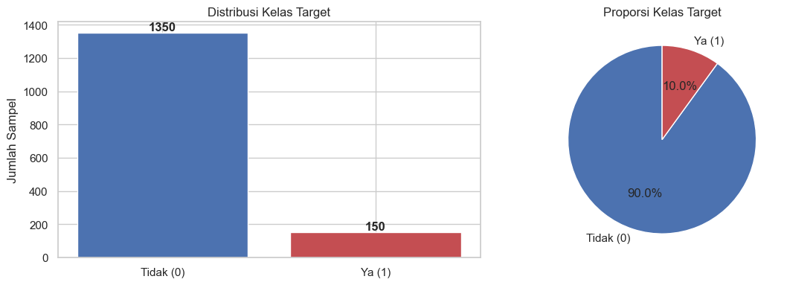
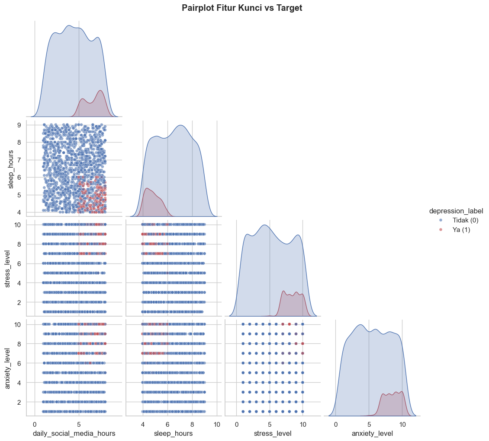
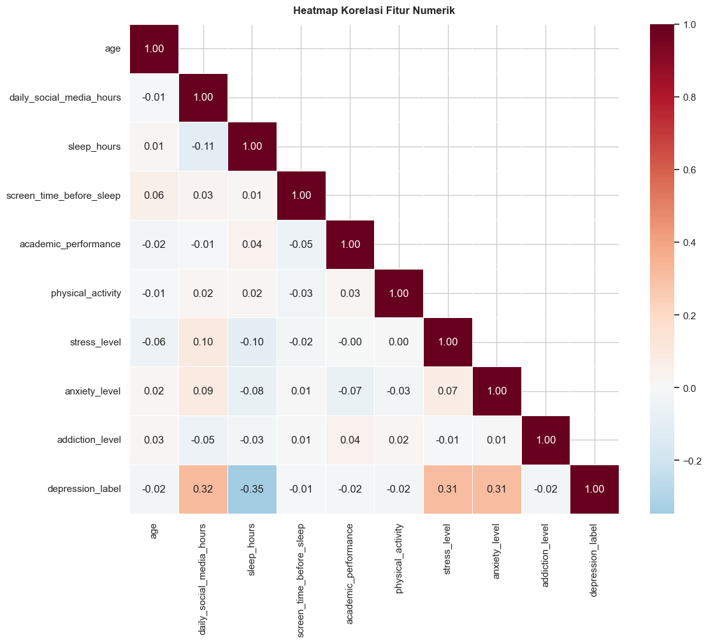
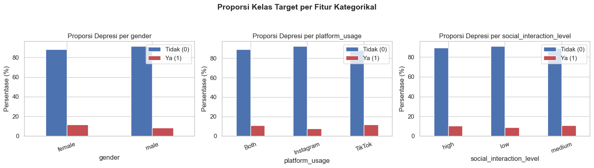

# Exploratory Data Analysis and Preprocessing

**Judul Proyek:** Eksperimen Klasifikasi Depresi pada Remaja: Perbandingan Metode Feature Selection untuk Identifikasi Fitur Gaya Hidup Paling Berpengaruh  

**Mahasiswa:** Naf’an Nur’Alim (A11.2024.15651)

---

## Referensi kode & hasil

Dokumentasi ini merujuk pada repository GitHub sekaligus hasil lokal proyek:

| Sumber | Tautan / path |
| --- | --- |
| **Repository GitHub** | [Nafunnn/Analysis-of-the-Impact-of-Preprocessing-and-Class-Imbalance-on-K-NN-and-Random-Forest-Models](https://github.com/Nafunnn/Analysis-of-the-Impact-of-Preprocessing-and-Class-Imbalance-on-K-NN-and-Random-Forest-Models) |
| **Notebook EDA** | [`notebooks/01_eda.ipynb`](https://github.com/Nafunnn/Analysis-of-the-Impact-of-Preprocessing-and-Class-Imbalance-on-K-NN-and-Random-Forest-Models/blob/main/eksperimen-klasifikasi-depresi/notebooks/01_eda.ipynb) |
| **Notebook Preprocessing** | [`notebooks/02_preprocessing.ipynb`](https://github.com/Nafunnn/Analysis-of-the-Impact-of-Preprocessing-and-Class-Imbalance-on-K-NN-and-Random-Forest-Models/blob/main/eksperimen-klasifikasi-depresi/notebooks/02_preprocessing.ipynb) |
| **Figures** | [`results/figures/`](https://github.com/Nafunnn/Analysis-of-the-Impact-of-Preprocessing-and-Class-Imbalance-on-K-NN-and-Random-Forest-Models/tree/main/eksperimen-klasifikasi-depresi/results/figures) |
| **Tables** | [`results/tables/`](https://github.com/Nafunnn/Analysis-of-the-Impact-of-Preprocessing-and-Class-Imbalance-on-K-NN-and-Random-Forest-Models/tree/main/eksperimen-klasifikasi-depresi/results/tables) |
| **Laporan eksperimen** | [`reports/Laporan_Hasil_Eksperimen.md`](https://github.com/Nafunnn/Analysis-of-the-Impact-of-Preprocessing-and-Class-Imbalance-on-K-NN-and-Random-Forest-Models/blob/main/eksperimen-klasifikasi-depresi/reports/Laporan_Hasil_Eksperimen.md) |

Pipeline notebook di repository:

```text
01_eda.ipynb  →  02_preprocessing.ipynb  →  03_experiment_feature_selection.ipynb  →  04_xai_shap_analysis.ipynb
```

---

## 1. Notebook EDA lengkap — struktur, visualisasi, dan penjelasan

Notebook `01_eda.ipynb` digunakan **hanya untuk eksplorasi**, bukan untuk menyimpulkan fitur terpenting secara final. Korelasi tunggal terhadap `depression_label` diperlakukan sebagai petunjuk awal; keputusan fitur berpengaruh ditetapkan di tahap feature selection + SHAP.

### 1.1 Alur isi notebook

| Bagian | Isi | Output visual / tabel |
| --- | --- | --- |
| Setup & load data | Baca `Teen_Mental_Health_Dataset.csv`, cek shape & tipe | Shape: **1.500 × 13** |
| Kualitas data | Missing values, info kolom | Missing = **0** |
| Statistik deskriptif | Mean, std, min–max, skew | `01_descriptive_statistics.csv` |
| Distribusi target | Count & proporsi kelas | `01_class_distribution.png` |
| Distribusi numerik | Histogram / densitas tiap fitur numerik | `02_numeric_distributions.png` |
| Distribusi kategorikal | Count plot `gender`, `platform_usage`, `social_interaction_level` | `03_categorical_distributions.png` |
| Heatmap korelasi | Korelasi antar fitur numerik | `04_correlation_heatmap.png` |
| Korelasi vs target | Pearson per fitur (eksploratif) | `05_target_correlation.png`, `04_target_correlation.csv` |
| Perbandingan per kelas | Mean fitur numerik & boxplot per label | `06_numeric_by_target.png`, `02_mean_by_class.csv` |
| Kategorikal vs target | Proporsi depresi per kategori | `07_categorical_vs_target.png` |
| Multikolinearitas | Pasangan \|r\| > 0,5 (motivasi PCA) | `05_multicollinearity_pairs.csv` |
| Pairplot fitur kunci | Relasi joint fitur kunci vs label | `08_pairplot_key_features.png` |
| Outlier IQR | Ringkasan batas & jumlah outlier | `03_outlier_summary.csv` |

### 1.2 Temuan ringkas dari EDA

1. Data bersih (tanpa missing), heterogen (numerik + kategorikal + ordinal).
2. **Class imbalance ~90:10** — accuracy saja menyesatkan; F1/Recall/ROC-AUC diprioritaskan.
3. Korelasi moderat tertinggi dengan target: `sleep_hours` (−0,346), `daily_social_media_hours` (+0,315), `stress_level` (+0,310), `anxiety_level` (+0,309).
4. Mean per kelas menunjukkan gap jelas pada sosial media, tidur, stres, dan kecemasan.
5. Tidak ada outlier di luar batas IQR pada pengecekan awal (semua fitur numerik 0 outlier).
6. Korelasi tunggal **tidak** menggantikan feature selection multi-fitur.

---

## 2. Lima insight paling penting (dengan visualisasi)

### Insight 1 — Class imbalance ekstrem (~90 : 10)

Kelas `depression_label = 0` mendominasi (1.350 sampel / 90%), sementara kelas positif hanya 150 sampel (10%). Model yang “asal prediksi mayoritas” bisa tampak akurat, tetapi gagal mendeteksi remaja terindikasi depresi.



**Implikasi preprocessing & evaluasi:** stratified split, `class_weight='balanced'` pada Random Forest, serta metrik F1 / Recall / ROC-AUC.

---

### Insight 2 — Empat fitur gaya hidup paling berkorelasi dengan label (masih eksploratif)

Korelasi Pearson dengan `depression_label`:

| Fitur | Korelasi |
| --- | ---: |
| `sleep_hours` | −0,346 |
| `daily_social_media_hours` | +0,315 |
| `stress_level` | +0,310 |
| `anxiety_level` | +0,309 |

Artinya: jam tidur lebih rendah, serta media sosial / stres / kecemasan lebih tinggi, berhubungan dengan indikasi depresi — tetapi hubungan multi-fitur masih diverifikasi di eksperimen seleksi fitur.


---

### Insight 3 — Pola mean berbeda tajam antara kelas depresi vs non-depresi

| Fitur | Mean non-depresi (0) | Mean depresi (1) | Selisih |
| --- | ---: | ---: | ---: |
| `daily_social_media_hours` | 4,49 | 6,64 | +2,15 |
| `sleep_hours` | 6,48 | 4,80 | −1,68 |
| `stress_level` | 5,40 | 8,43 | +3,03 |
| `anxiety_level` | 5,54 | 8,49 | +2,96 |

Remaja terindikasi depresi cenderung lebih lama di media sosial, lebih sedikit tidur, serta stres & kecemasan lebih tinggi.


---

### Insight 4 — Hubungan multi-fitur terlihat pada pairplot (bukan satu atribut saja)

Pairplot fitur kunci menunjukkan sebaran kelas positif cenderung mengelompok pada kombinasi: sleep rendah + social media / stres / anxiety tinggi. Ini mendukung argumen riset bahwa indikasi depresi bersifat **kombinasi atribut**, sehingga diperlukan feature selection (bukan hanya ranking korelasi tunggal).



---

### Insight 5 — Data relatif bersih; scaling tetap wajib sebelum PCA / filter methods

- Missing values: **0**
- Outlier IQR (sebelum clipping): **0** pada semua fitur numerik
- Tetap dilakukan IQR clipping sebagai safety net, lalu encoding & dual scaling

Heatmap korelasi membantu melihat struktur antar-fitur (motivasi uji PCA), sementara visualisasi scaling menegaskan distribusi dinormalisasi agar PCA/MI tidak bias skala.




---

### Visualisasi EDA pendukung lainnya

| Visualisasi | File |
| --- | --- |
| Distribusi fitur numerik |  |
| Distribusi fitur kategorikal |  |
| Proporsi depresi per kategori |  |

*(Gambar di atas juga tersedia di folder `eksperimen-klasifikasi-depresi/results/figures/` pada repository GitHub.)*

---

## 3. Dokumentasi preprocessing & justifikasi teknik

Source of truth: [`02_preprocessing.ipynb`](https://github.com/Nafunnn/Analysis-of-the-Impact-of-Preprocessing-and-Class-Imbalance-on-K-NN-and-Random-Forest-Models/blob/main/eksperimen-klasifikasi-depresi/notebooks/02_preprocessing.ipynb).

### 3.1 Ringkasan hasil preprocessing

| Tahap | Nilai |
| --- | ---: |
| Raw samples | 1.500 |
| After cleaning | 1.500 |
| Features setelah encoding + FE | 14 (lihat daftar di bawah) |
| Train samples | 1.200 |
| Test samples | 300 |
| Positive class (train / test) | 120 / 30 |
| Proporsi kelas train & test | tetap **0,9 : 0,1** (stratified) |

Sumber: `results/tables/08_preprocessing_summary.csv`.

### 3.2 Langkah demi langkah + justifikasi

#### Langkah 1 — Pengecekan & imputasi missing values

| Aspek | Detail |
| --- | --- |
| **Teknik** | Median untuk numerik; modus untuk kategorikal (jika ada missing) |
| **Hasil** | Missing sebelum & sesudah = **0** (tidak ada sel kosong) |
| **Justifikasi** | Median/modus tahan terhadap outlier dibanding mean; menjaga pipeline tetap robust jika data baru memiliki missing |

#### Langkah 2 — Penanganan outlier (IQR clipping)

| Aspek | Detail |
| --- | --- |
| **Teknik** | Hitung Q1, Q3, IQR; clip nilai ke `[Q1 − 1.5·IQR, Q3 + 1.5·IQR]` |
| **Hasil** | `06_outlier_clipping_log.csv` → **0 nilai diclip** (data sudah dalam rentang wajar) |
| **Justifikasi** | Clipping mempertahankan jumlah sampel (penting saat kelas positif jarang), mencegah nilai ekstrem merusak scaling & PCA, tanpa membuang observasi langka kelas depresi |

#### Langkah 3 — Feature engineering: `screen_time_ratio`

| Aspek | Detail |
| --- | --- |
| **Formula** | `screen_time_before_sleep / sleep_hours` |
| **Interpretasi** | Rasio tinggi ≈ paparan layar sebelum tidur relatif terhadap durasi tidur → indikasi gangguan ritme sirkadian |
| **Justifikasi** | Fitur komposit relevan secara psikologis/kesehatan mental remaja; menambah sinyal perilaku digital yang tidak sepenuhnya tercakup oleh fitur mentah terpisah |

#### Langkah 4 — Encoding fitur kategorikal

| Fitur | Teknik | Mapping / hasil | Justifikasi |
| --- | --- | --- | --- |
| `gender` | Binary / label encoding | `male=0`, `female=1` | Hanya 2 kategori, tanpa urutan klinis yang kompleks |
| `social_interaction_level` | Ordinal encoding | `low=0`, `medium=1`, `high=2` | Ada hierarki bermakna (rendah → tinggi) |
| `platform_usage` | One-hot encoding | `platform_Instagram`, `platform_TikTok` (+ drop salah satu level / `Both` untuk hindari dummy trap) | Platform bersifat nominal (tanpa ranking Instagram &gt; TikTok) |

**Justifikasi umum encoding:** model & filter methods (Chi-Square, Mutual Information) membutuhkan input numerik; pemilihan skema encoding mengikuti sifat skala pengukuran tiap variabel.

#### Langkah 5 — Stratified train/test split (80 : 20)

| Aspek | Detail |
| --- | --- |
| **Teknik** | `train_test_split(..., stratify=y, test_size=0.2, random_state=42)` |
| **Hasil** | Train 1.200, test 300; rasio kelas tetap 90:10 di kedua set |
| **Justifikasi** | Tanpa stratify, kelas minoritas bisa jarang/hilang di fold tertentu; stratification menjaga evaluasi F1/Recall valid pada data imbalance |

#### Langkah 6 — Dual scaling (fit hanya pada train)

| Scaler | Dipakai untuk | Justifikasi |
| --- | --- | --- |
| **StandardScaler** (mean=0, std=1) | PCA & Mutual Information | PCA berbasis variansi → tanpa scaling, fitur berentang besar mendominasi komponen; skala seragam juga menstabilkan perhitungan MI pada fitur numerik |
| **MinMaxScaler** ([0, 1]) | Chi-Square (`SelectKBest(chi2)`) | Implementasi `chi2` di scikit-learn mensyaratkan fitur **non-negatif** |

Scaler di-**fit hanya pada training set**, lalu diterapkan ke test set → mencegah **data leakage**.

Bukti visual: `assets/09_scaling_comparison.png` (juga `07_scaling_comparison.csv`).

#### Langkah 7 — Persistensi artefak

File yang dihasilkan untuk eksperimen feature selection:

| File | Penggunaan |
| --- | --- |
| `train_scaled.csv` / `test_scaled.csv` | PCA, Mutual Information |
| `train_minmax.csv` / `test_minmax.csv` | Chi-Square |
| `train_unscaled.csv` / `test_unscaled.csv` | Referensi / baseline all-features |
| `artifacts/preprocessing_metadata.json`, scaler `.joblib` | Reproducibility |

### 3.3 Daftar fitur setelah preprocessing (siap eksperimen FS)

1. `age`  
2. `gender`  
3. `daily_social_media_hours`  
4. `sleep_hours`  
5. `screen_time_before_sleep`  
6. `academic_performance`  
7. `physical_activity`  
8. `social_interaction_level`  
9. `stress_level`  
10. `anxiety_level`  
11. `addiction_level`  
12. `screen_time_ratio` *(engineered)*  
13. `platform_Instagram`  
14. `platform_TikTok`  

Sumber: `results/tables/09_feature_columns.csv`.

---

## 4. Diagram alur EDA → Preprocessing

```text
Teen_Mental_Health_Dataset.csv (1.500 × 13)
        │
        ▼
┌───────────────────────┐
│  01_eda.ipynb         │  distribusi, korelasi, outlier,
│  (eksplorasi saja)    │  class imbalance, pairplot
└───────────┬───────────┘
            ▼
┌───────────────────────┐
│  02_preprocessing     │  cleaning → FE → encoding
│                       │  → stratified split → dual scaling
└───────────┬───────────┘
            ▼
  data/processed/*.csv + artifacts/
            │
            ▼
  03_experiment_feature_selection.ipynb
  (PCA / Chi-Square / Mutual Information / baseline)
```

---

## 5. Kesimpulan tahap ini

EDA menegaskan tiga isu desain eksperimen: **class imbalance**, **hubungan multi-fitur** (bukan satu korelasi tunggal), dan **perbedaan skala atribut**. Preprocessing menormalisasi isu tersebut dengan stratified split, encoding yang sesuai skala pengukuran, feature engineering `screen_time_ratio`, serta dual scaling agar PCA, Chi-Square, dan Mutual Information dapat dibandingkan secara adil pada notebook eksperimen berikutnya.

**Bukti kode & visualisasi lengkap:**  
https://github.com/Nafunnn/Analysis-of-the-Impact-of-Preprocessing-and-Class-Imbalance-on-K-NN-and-Random-Forest-Models
