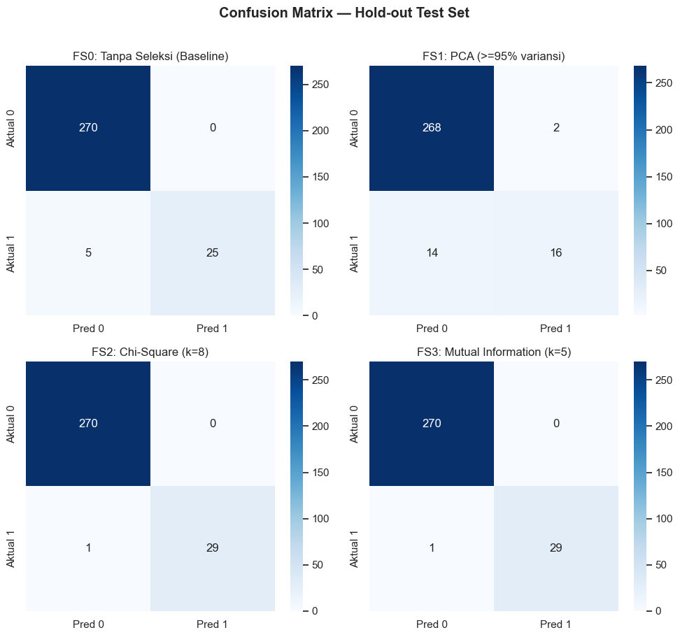
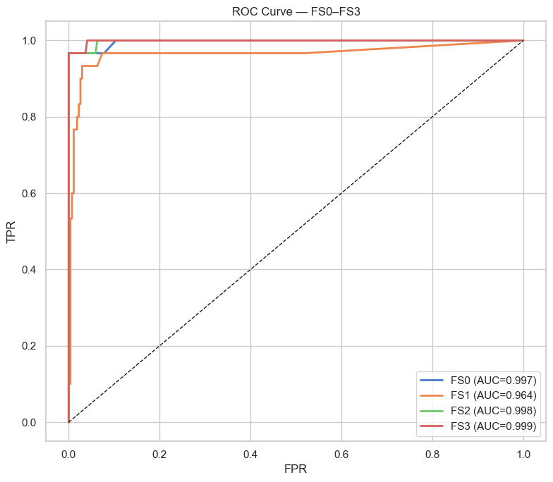
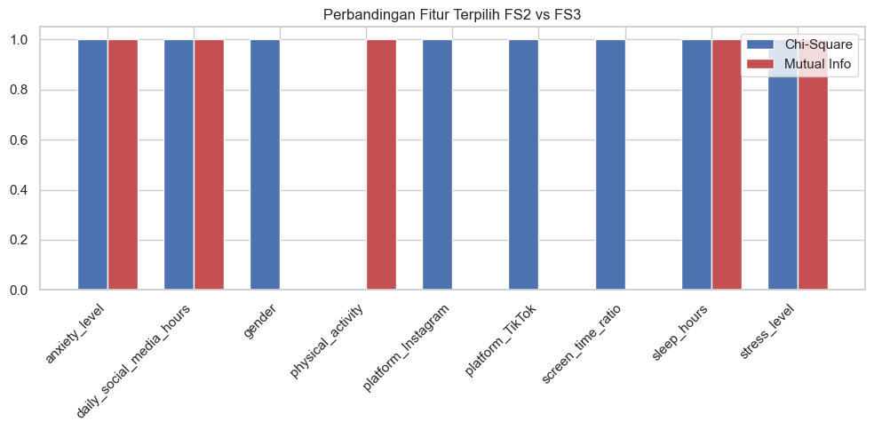

# Modeling and Evaluation

**Judul Proyek:** Eksperimen Klasifikasi Depresi pada Remaja: Perbandingan Metode Feature Selection untuk Identifikasi Fitur Gaya Hidup Paling Berpengaruh  

**Mahasiswa:** Naf’an Nur’Alim (A11.2024.15651)

---

## Referensi kode & hasil

| Sumber | Tautan / path |
| --- | --- |
| **Repository** | [Nafunnn/Analysis-of-the-Impact-of-Preprocessing…](https://github.com/Nafunnn/Analysis-of-the-Impact-of-Preprocessing-and-Class-Imbalance-on-K-NN-and-Random-Forest-Models) |
| **Notebook modeling** | [`03_experiment_feature_selection.ipynb`](https://github.com/Nafunnn/Analysis-of-the-Impact-of-Preprocessing-and-Class-Imbalance-on-K-NN-and-Random-Forest-Models/blob/main/eksperimen-klasifikasi-depresi/notebooks/03_experiment_feature_selection.ipynb) |
| **Notebook XAI (interpretasi)** | [`04_xai_shap_analysis.ipynb`](https://github.com/Nafunnn/Analysis-of-the-Impact-of-Preprocessing-and-Class-Imbalance-on-K-NN-and-Random-Forest-Models/blob/main/eksperimen-klasifikasi-depresi/notebooks/04_xai_shap_analysis.ipynb) |
| **Model terbaik** | `artifacts/best_fs_model.joblib` |
| **Tabel hasil** | [`results/tables/`](https://github.com/Nafunnn/Analysis-of-the-Impact-of-Preprocessing-and-Class-Imbalance-on-K-NN-and-Random-Forest-Models/tree/main/eksperimen-klasifikasi-depresi/results/tables) |

> **Catatan desain eksperimen:** fokus penelitian adalah **perbandingan metode feature selection** (FS0–FS3), bukan perbandingan banyak algoritma. Klasifikator tetap **Random Forest** agar perbedaan performa benar-benar berasal dari metode seleksi fitur. Residual plot (umum pada regresi) diganti dengan metrik & visual klasifikasi: confusion matrix, ROC curve, perbandingan F1/Recall/AUC, serta cek overfitting CV vs test.

---

## 1. Konfigurasi training

| Komponen | Nilai |
| --- | --- |
| Algoritma | `RandomForestClassifier` |
| `n_estimators` | 100 |
| `class_weight` | `'balanced'` (menangani imbalance 90:10) |
| `random_state` | 42 |
| Validasi | Stratified 5-Fold CV pada train (1.200 sampel) |
| Evaluasi akhir | Hold-out test set (300 sampel, stratified 80:20) |
| Metrik utama | **F1-Score**, **Recall**, **ROC-AUC** (accuracy sekunder) |

### 1.1 Empat skenario model (FS0–FS3)

| Kode | Metode seleksi | Input data | Representasi fitur |
| --- | --- | --- | --- |
| **FS0** | Tanpa seleksi (baseline) | StandardScaler | Semua 14 fitur |
| **FS1** | PCA (≥95% variansi) | StandardScaler | 12 komponen utama |
| **FS2** | Chi-Square (`SelectKBest`) | MinMaxScaler | Top-*k* fitur (k optimal = 8) |
| **FS3** | Mutual Information | StandardScaler | Top-*k* fitur (k optimal = 5) |

---

## 2. Kode training dan tuning

Cuplikan inti dari `03_experiment_feature_selection.ipynb` (lengkap di repository).

### 2.1 Parameter model & helper evaluasi

```python
RANDOM_STATE = 42
CV_FOLDS = 5
K_CANDIDATES = [5, 8, 10]
PCA_VARIANCE = 0.95
RF_PARAMS = dict(
    n_estimators=100,
    class_weight='balanced',
    random_state=RANDOM_STATE,
)

cv = StratifiedKFold(n_splits=CV_FOLDS, shuffle=True, random_state=RANDOM_STATE)
scoring = {
    'accuracy': 'accuracy',
    'precision': 'precision',
    'recall': 'recall',
    'f1': 'f1',
    'roc_auc': 'roc_auc',
}

def run_cv(pipeline, X, y):
    scores = cross_validate(
        pipeline, X, y, cv=cv, scoring=scoring,
        return_train_score=False, n_jobs=-1,
    )
    return {m: scores[f'test_{m}'].mean() for m in scoring}

def eval_test(pipeline, X_train, y_train, X_test, y_test):
    pipeline.fit(X_train, y_train)
    y_pred = pipeline.predict(X_test)
    y_proba = pipeline.predict_proba(X_test)[:, 1]
    return {
        'accuracy': accuracy_score(y_test, y_pred),
        'precision': precision_score(y_test, y_pred, zero_division=0),
        'recall': recall_score(y_test, y_pred, zero_division=0),
        'f1': f1_score(y_test, y_pred, zero_division=0),
        'roc_auc': roc_auc_score(y_test, y_proba),
        'y_pred': y_pred,
        'y_proba': y_proba,
        'pipeline': pipeline,
    }
```

Feature selection dimasukkan ke dalam `sklearn.pipeline.Pipeline` agar seleksi hanya dijalankan pada fold latih (mencegah data leakage).

### 2.2 Tuning *k* (Chi-Square & Mutual Information)

Nilai *k* ∈ {5, 8, 10} diuji dengan 5-Fold CV; *k* dengan **CV F1 tertinggi** dipilih.

```python
for k in K_CANDIDATES:
    pipe_chi2 = Pipeline([
        ('select', SelectKBest(chi2, k=k)),
        ('clf', RandomForestClassifier(**RF_PARAMS)),
    ])
    pipe_mi = Pipeline([
        ('select', SelectKBest(mutual_info_classif, k=k)),
        ('clf', RandomForestClassifier(**RF_PARAMS)),
    ])
    cv_chi2 = run_cv(pipe_chi2, X_train_m, y_train)  # MinMax
    cv_mi = run_cv(pipe_mi, X_train_s, y_train)      # Standard
    # simpan skor; pilih k dengan F1 tertinggi
```

**Hasil tuning:**

| Metode | k | CV Accuracy | CV Precision | CV Recall | **CV F1** | CV ROC-AUC |
| --- | ---: | ---: | ---: | ---: | ---: | ---: |
| Chi-Square | 5 | 0,9925 | 0,9746 | 0,9500 | 0,9619 | 0,9990 |
| Chi-Square | **8** | 0,9942 | 0,9913 | 0,9500 | **0,9698** | 0,9993 |
| Chi-Square | 10 | 0,9933 | 0,9826 | 0,9500 | 0,9660 | 0,9990 |
| Mutual Information | **5** | 0,9917 | 0,9743 | 0,9417 | **0,9574** | 0,9980 |
| Mutual Information | 8 | 0,9892 | 0,9735 | 0,9167 | 0,9437 | 0,9990 |
| Mutual Information | 10 | 0,9900 | 0,9735 | 0,9250 | 0,9484 | 0,9991 |

→ **k optimal:** Chi-Square = **8**, Mutual Information = **5**.


### 2.3 Tuning jumlah komponen PCA

```python
pca_probe = PCA(n_components=0.95, random_state=RANDOM_STATE)
pca_probe.fit(X_train_s)
n_pca = pca_probe.n_components_  # → 12 komponen, cum. variance ≈ 96,38%
```


| Komponen | Explained variance | Kumulatif |
| --- | ---: | ---: |
| PC1 | 0,1436 | 0,1436 |
| … | … | … |
| PC12 | 0,0603 | **0,9638** (≥ 95%) |

### 2.4 Training eksperimen utama (FS0–FS3)

```python
scenarios = {
    'FS0': {
        'pipeline': Pipeline([
            ('clf', RandomForestClassifier(**RF_PARAMS)),
        ]),
        'X_train': X_train_s, 'X_test': X_test_s,
    },
    'FS1': {
        'pipeline': Pipeline([
            ('pca', PCA(n_components=0.95, random_state=RANDOM_STATE)),
            ('clf', RandomForestClassifier(**RF_PARAMS)),
        ]),
        'X_train': X_train_s, 'X_test': X_test_s,
    },
    'FS2': {
        'pipeline': Pipeline([
            ('select', SelectKBest(chi2, k=best_k_chi2)),  # k=8
            ('clf', RandomForestClassifier(**RF_PARAMS)),
        ]),
        'X_train': X_train_m, 'X_test': X_test_m,
    },
    'FS3': {
        'pipeline': Pipeline([
            ('select', SelectKBest(mutual_info_classif, k=best_k_mi)),  # k=5
            ('clf', RandomForestClassifier(**RF_PARAMS)),
        ]),
        'X_train': X_train_s, 'X_test': X_test_s,
    },
}

for code_id, cfg in scenarios.items():
    cv_res = run_cv(cfg['pipeline'], cfg['X_train'], y_train)
    test_res = eval_test(
        cfg['pipeline'], cfg['X_train'], y_train,
        cfg['X_test'], y_test,
    )
```

Model terbaik disimpan ke `artifacts/best_fs_model.joblib` untuk analisis SHAP.

---

## 3. Tabel perbandingan performa

### 3.1 Cross-validation (train, 5-Fold)

| Skenario | Metode | Fitur | CV Acc | CV Prec | CV Recall | **CV F1** | CV ROC-AUC |
| --- | --- | --- | ---: | ---: | ---: | ---: | ---: |
| FS0 | Baseline | 14 fitur | 0,9900 | 0,9913 | 0,9083 | 0,9476 | 0,9994 |
| FS1 | PCA | 12 PC | 0,9575 | 0,9523 | 0,6083 | 0,7387 | 0,9890 |
| FS2 | Chi-Square (k=8) | Top-8 | 0,9942 | 0,9913 | 0,9500 | **0,9698** | 0,9993 |
| FS3 | Mutual Information (k=5) | Top-5 | 0,9908 | 0,9739 | 0,9333 | 0,9528 | 0,9980 |

Sumber: `11_cv_results_fs_comparison.csv`.

### 3.2 Hold-out test set (evaluasi akhir)

| Skenario | Metode | Accuracy | Precision | Recall | **F1** | **ROC-AUC** |
| --- | --- | ---: | ---: | ---: | ---: | ---: |
| FS0 | Tanpa seleksi (14 fitur) | 0,9833 | 1,0000 | 0,8333 | 0,9091 | 0,9970 |
| FS1 | PCA (≥95%, 12 PC) | 0,9467 | 0,8889 | 0,5333 | 0,6667 | 0,9644 |
| FS2 | Chi-Square (k=8) | 0,9967 | 1,0000 | 0,9667 | **0,9831** | 0,9980 |
| **FS3** | **Mutual Information (k=5)** | **0,9967** | **1,0000** | **0,9667** | **0,9831** | **0,9987** |

Sumber: `12_test_results_fs_comparison.csv`.

### 3.3 F1 per kelas (test set)

| Skenario | F1 kelas 0 (non-depresi) | F1 kelas 1 (depresi) |
| --- | ---: | ---: |
| FS0 | 0,9908 | 0,9091 |
| FS1 | 0,9710 | 0,6667 |
| FS2 | 0,9982 | **0,9831** |
| FS3 | 0,9982 | **0,9831** |

Sumber: `18_classification_report_by_class.csv`.

### 3.4 Stabilitas: CV F1 vs Test F1 (overfitting check)

| Skenario | CV F1 | Test F1 | Δ (Test − CV) |
| --- | ---: | ---: | ---: |
| FS0 | 0,9476 | 0,9091 | −0,0385 |
| FS1 | 0,7387 | 0,6667 | −0,0720 |
| FS2 | 0,9698 | 0,9831 | +0,0133 |
| FS3 | 0,9528 | 0,9831 | +0,0303 |

FS2 & FS3 relatif stabil (tidak turun tajam di test). PCA (FS1) paling lemah, terutama Recall.

---

## 4. Visualisasi hasil evaluasi

### 4.1 Perbandingan metrik (F1, Recall, ROC-AUC)


FS2 dan FS3 unggul jelas dibanding baseline (FS0) dan PCA (FS1), terutama pada F1 & Recall kelas positif.

### 4.2 Confusion matrix (hold-out test)



Interpretasi singkat:
- **FS0:** Recall kelas depresi lebih rendah (lebih banyak false negative).
- **FS1 (PCA):** paling banyak miss pada kelas positif.
- **FS2 & FS3:** false negative paling sedikit; precision kelas positif mendekati sempurna di test set.

### 4.3 ROC curves



Semua skenario filter/baseline punya AUC sangat tinggi; **FS3 (0,9987)** sedikit di atas FS2 (0,9980). PCA paling rendah (0,9644).

### 4.4 Ranking fitur (interpretabilitas filter methods)




> **Tentang residual plots:** proyek ini adalah **klasifikasi biner**, bukan regresi. Residual plot (prediksi − aktual kontinu) tidak relevan; evaluasi visual yang dipakai adalah confusion matrix, ROC, bar metrik, dan ranking fitur.

---

## 5. Model terbaik & interpretasi hasil

### 5.1 Model terbaik: **FS3 — Mutual Information (k=5) + Random Forest**

**Alasan pemilihan:**

| Kriteria | Bukti |
| --- | --- |
| F1-Score test | **0,9831** (seri dengan FS2, jauh di atas FS0/FS1) |
| ROC-AUC test | **0,9987** (tertinggi) |
| Kompleksitas | Hanya **5 fitur** (lebih ringkas dari FS2=8 dan FS0=14) |
| Interpretabilitas | Nama fitur asli dipertahankan (berbeda dari PCA) |
| Stabilitas | Test F1 tidak anjlok dibanding CV |

Pipeline terbaik:

```text
SelectKBest(mutual_info_classif, k=5) → RandomForestClassifier(
    n_estimators=100, class_weight='balanced', random_state=42
)
```

### 5.2 Fitur yang dipakai model terbaik (top-5 MI)

| Rank | Fitur | Skor MI |
| ---: | --- | ---: |
| 1 | `sleep_hours` | 0,1014 |
| 2 | `stress_level` | 0,0828 |
| 3 | `daily_social_media_hours` | 0,0797 |
| 4 | `anxiety_level` | 0,0733 |
| 5 | `physical_activity` | 0,0412 |

### 5.3 Fitur paling konsisten (FS2 ∩ FS3)

Empat fitur muncul di kedua metode filter:

1. `sleep_hours`
2. `stress_level`
3. `anxiety_level`
4. `daily_social_media_hours`

Artinya, secara empiris, indikasi depresi pada dataset ini paling terkait dengan **kualitas tidur, stres, kecemasan, dan durasi media sosial** — selaras dengan petunjuk EDA, tetapi kini dikonfirmasi lewat seleksi multi-fitur dalam pipeline klasifikasi.

### 5.4 Interpretasi per metode (RQ3)

| Metode | Karakteristik di eksperimen ini | Kesimpulan praktis |
| --- | --- | --- |
| **FS0 Baseline** | F1 0,9091; Recall 0,8333 | Bagus, tapi masih “bocor” di kelas positif; fitur redundan ikut dibawa |
| **FS1 PCA** | F1 0,6667; Recall 0,5333; output = PC1–PC12 | Reduksi dimensi berhasil (≥95% variansi), tetapi **hilang nama fitur** dan performa turun — kurang cocok jika tujuan = interpretasi klinis |
| **FS2 Chi-Square** | F1 0,9831; 8 fitur | Sangat kompetitif; mudah ditafsirkan; sedikit lebih banyak fitur dari MI |
| **FS3 Mutual Information** | F1 0,9831; AUC tertinggi; 5 fitur | **Pilihan terbaik keseluruhan**: ringkas, performa tinggi, tetap interpretable |

### 5.5 Jawaban singkat research questions

| Kode | Jawaban |
| --- | --- |
| **RQ1** | Metode terbaik: **Mutual Information (FS3)** |
| **RQ2** | Fitur paling berpengaruh & konsisten: **sleep_hours, stress_level, anxiety_level, daily_social_media_hours** |
| **RQ3** | Filter methods (Chi² & MI) unggul untuk tugas + interpretasi; PCA kuat di reduksi dimensi tetapi lemah di performa & interpretabilitas pada dataset ini |
| **RQ4** | Dilanjutkan di notebook SHAP — hasil selaras kuat dengan MI (Spearman ≈ 0,87); verifikasi XAI di `04_xai_shap_analysis.ipynb` |

### 5.6 Validasi hipotesis

| Hipotesis | Status | Bukti |
| --- | --- | --- |
| **H1** MI > Chi-Square pada F1 | Sebagian (F1 seri) | F1 FS3 = FS2 = 0,9831; FS3 unggul di ROC-AUC |
| **H2** PCA kehilangan interpretabilitas nama fitur | Diterima | Output PC1–PC12 |
| **H3** Feature selection meningkatkan performa vs baseline | Diterima | Baseline F1 0,9091 → terbaik 0,9831 |
| **H4** Fitur tidur/stres/kecemasan (dll.) konsisten terpilih | Diterima | Empat fitur overlap FS2 ∩ FS3 |

---

## 6. Kesimpulan tahap modeling

Eksperimen menunjukkan bahwa **seleksi fitur berbasis Mutual Information + Random Forest** memberikan performa klasifikasi terbaik pada hold-out test (F1 = 0,9831, ROC-AUC = 0,9987) dengan subset fitur paling hemat. Chi-Square hampir setara secara F1, sementara PCA kurang direkomendasikan bila tujuan utama adalah interpretasi fitur gaya hidup. Temuan ini mendukung klaim riset: indikasi depresi remaja pada dataset ini lebih tepat dipahami sebagai **kombinasi multi-fitur**, bukan korelasi tunggal.

**Kode & artefak lengkap:**  
https://github.com/Nafunnn/Analysis-of-the-Impact-of-Preprocessing-and-Class-Imbalance-on-K-NN-and-Random-Forest-Models
